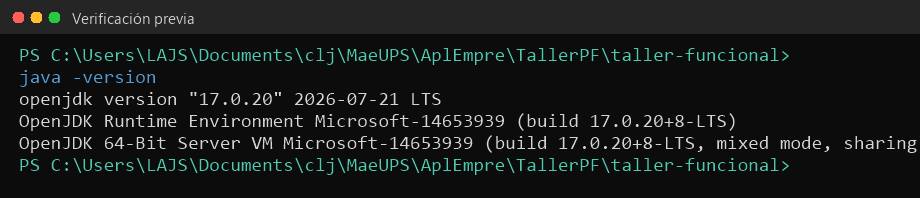
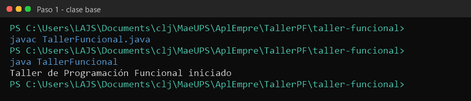
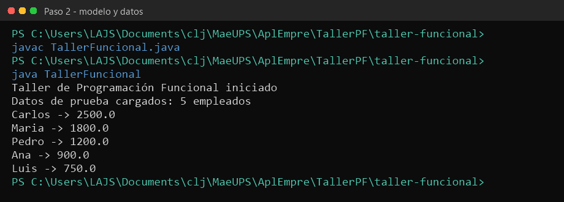
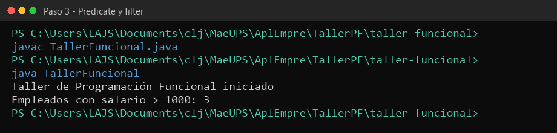
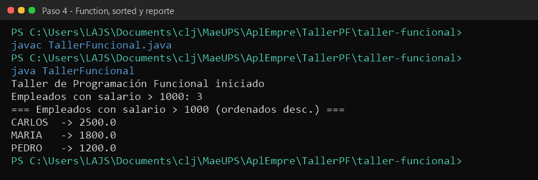
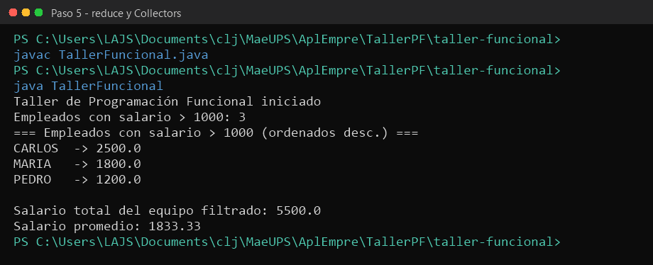
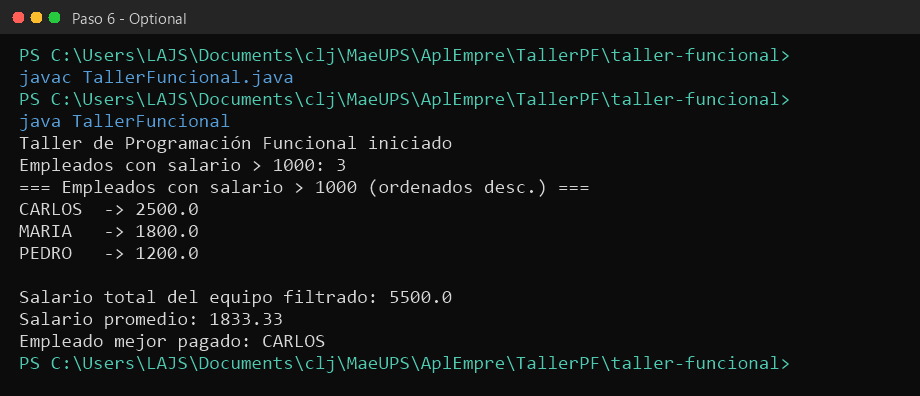
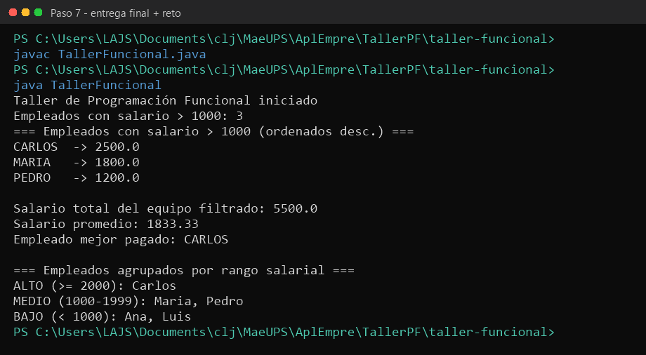

# Taller práctico: Programación Funcional en Java

Curso: Desarrollo de Aplicaciones Empresariales  
Clase: `taller-funcional/TallerFuncional.java`  
JDK: 17+

```
cd taller-funcional
javac TallerFuncional.java
java TallerFuncional
```

Las capturas de consola están en la carpeta `capturas/`.

## Verificación previa

```
java -version
```



## Paso 1 — Clase base

Se crea `taller-funcional/TallerFuncional.java` con el `main` mínimo y se comprueba el entorno.



## Paso 2 — Modelo `Empleado` y datos de prueba

`record` inmutable (Java 17) y lista de 5 empleados con `List.of` (inmutable).



## Paso 3 — Filtrar con `Predicate` y `Stream.filter`

Lambda `e -> e.salario() > 1000`. Deben quedar 3 empleados: Carlos, Maria y Pedro.



## Paso 4 — `Function`, referencias a método y ordenamiento

- Lambda en `forEach` para imprimir cada empleado.
- Referencia a método `Empleado::salario` en `comparingDouble`.
- `Function<Empleado, String>` para pasar el nombre a mayúsculas.
- Orden descendente por salario.



## Paso 5 — Totales con `reduce` y `Collectors`

- Total: `map` + `reduce(0.0, Double::sum)` → `5500.0`
- Promedio: `Collectors.averagingDouble` → `1833.33`



## Paso 6 — Máximo con `Optional`

`Stream.max` devuelve `Optional<Empleado>`. Se resuelve con `ifPresentOrElse` (sin `.get()`).



Salida alineada con la sección 4 del taller:

- CARLOS → 2500.0
- MARIA → 1800.0
- PEDRO → 1200.0
- Total 5500.0 · Promedio 1833.33 · Mejor pagado CARLOS

## Paso 7 — Verificación final y reto opcional

- Compila sin errores.
- La ejecución coincide con la salida esperada.
- Hay lambda, referencia a método, Stream y Optional.
- Reto: `Collectors.groupingBy` por rango salarial y `Collectors.joining` para los nombres.



## Autoevaluación

**1) ¿Qué ventaja ofrece usar Stream frente a un bucle for tradicional en este ejercicio?**

El Stream describe *qué* se quiere hacer (filtrar, ordenar, sumar) en una cadena declarativa, sin mutar la lista original ni mezclar acumulación, comparación e impresión en el mismo bucle. El código queda más corto, más fácil de leer y se puede paralelizar si hiciera falta.

**2) ¿Por qué Optional evita un error en tiempo de ejecución al buscar el empleado mejor pagado?**

`max()` no devuelve `null`: devuelve un `Optional` vacío si no hay elementos. Con `ifPresentOrElse` solo se usa el empleado cuando existe; si el filtro no dejara a nadie, se imprime el mensaje alternativo y no ocurre un `NullPointerException` (el error típico de llamar `.get()` sobre un Optional vacío).

**3) ¿Qué diferencia existe entre una expresión lambda y una referencia a método?**

La lambda es una función anónima (`e -> e.salario() > 1000`). La referencia a método (`Empleado::salario`, `Double::sum`) apunta a un método que ya existe cuando su firma coincide con la interfaz funcional; es la forma abreviada de la lambda equivalente.